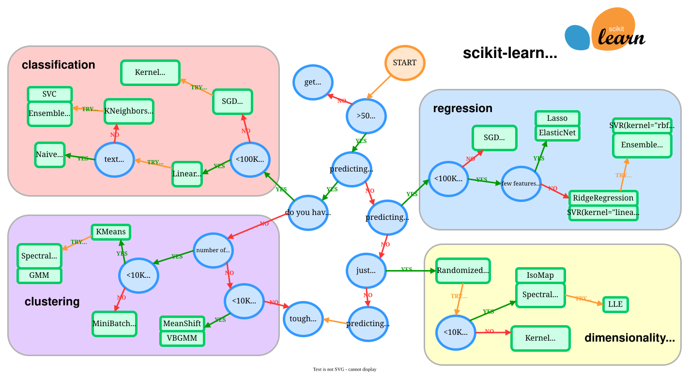

# 06 · Machine learning

[Course home](../../README.md) · [Setup](../../docs/START_HERE.md) · [Learning path](../../docs/COURSE_MAP.md)

Linear and multiple regression, gradient descent, and linear/polynomial support vector machines.

**Before you start:** Pandas, statistics, and train/test evaluation; base environment.

Read the [slides](slides/README.md), then work through the notebooks below in order. Start a fresh kernel for each notebook and run its setup cell first. Dataset requirements and generated-file behavior are listed in [datasets](datasets/README.md).

## Lessons and practice

| Notebook | Type | Preparation |
| --- | --- | --- |
| [A first linear regression example](code/01_linear_regression_example.ipynb) | Lesson | CPU sample |
| [Linear regression and gradient descent](code/02_linear_regression_lecture.ipynb) | Lesson | External data |
| [Multiple linear regression](code/03_multiple_linear_regression.ipynb) | Lesson | External data |
| [Linear and polynomial SVMs](code/04_svm_linear_and_polynomial.ipynb) | Exercise | Classroom |

## Lesson notes

- The placement.csv classroom dataset is not in the original repository.
- The original smart_healthcare_dataset1.csv must be supplied by the instructor.

## Preserved alternate copies

These notebooks retain earlier module copies or variants. Follow the main lesson list first.

| Copy | Note |
| --- | --- |
| [Linear regression lecture — alternate copy](code/archive/linear_regression_lecture_copy.ipynb) | Original alternate copy retained; needs placement.csv. |

Continue with the [module assignments](../../assignments/06-machine-learning/README.md).

## Supplementary estimator reference

The scikit-learn flowchart offers starting points when choosing an estimator. Use evaluation on your own data to compare candidates.

[Interactive official chart](https://scikit-learn.org/stable/machine_learning_map.html) · [Source and license](../../assets/references/README.md)

Official supplementary reading is indexed in [resources](../../docs/RESOURCES.md).
